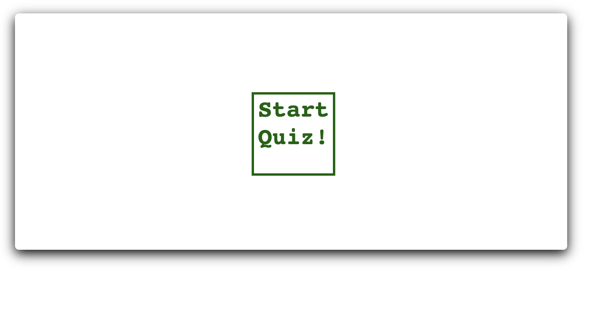
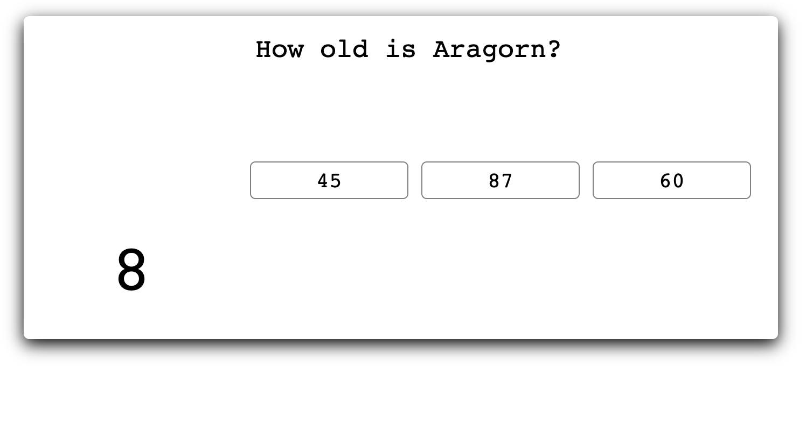
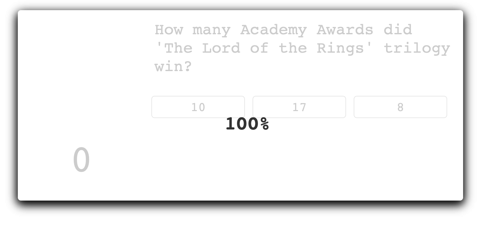

# javascript-quiz

* The following code creates a timed quiz. 

* This is a 5 question Lord of the Rings quiz. Each question has a timer that will count up to 15 (intervals being 1 second) - once the timer has reached 15 seconds, the question will automatically be marked incorrect and move on to the next question. 

* There are three optional answers for each question, once an option is selected the quiz will move on to the next question. Only one option is the 'correct' answer. Correct & incorrect answers will be recorded throughout the quiz. 

* To start the quiz, a container with a 'start quiz' option inside must be pressed, which will then launch the first question. 

* During the quiz the question can be seen at the top of the container, with the three options below, and a timer clock in the bottom left corner. 

* Once all 5 questions have been answered, the quiz will end and a percentage value will appear which details the % of questions answered correctly within the time constraints. 

* The window will need to be refreshed in order to restart the quiz. 

(This quiz was made thanks in large part to 'Code Explained' on Youtube)